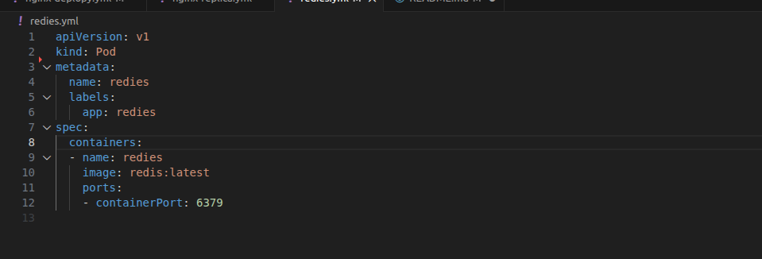
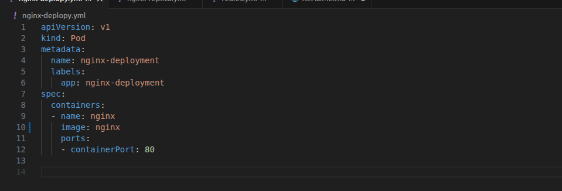
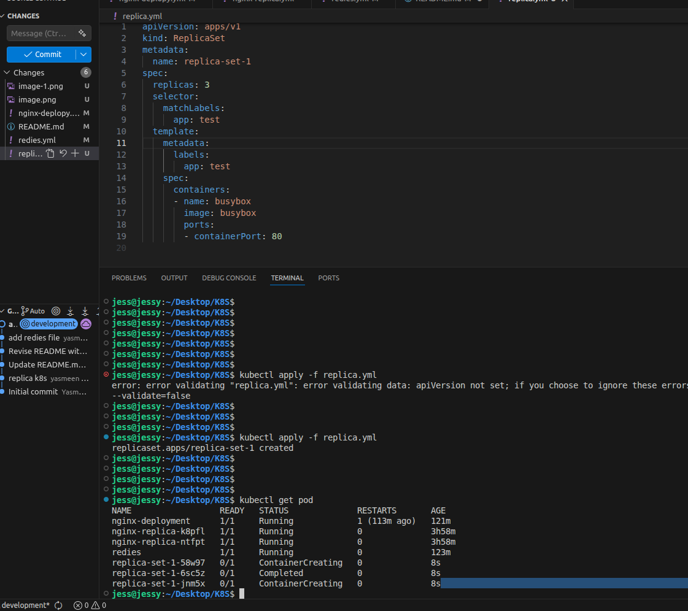
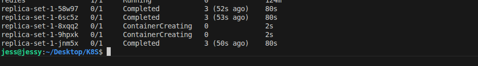

# K8S-For-DevOps

1. Install a Kubernetes cluster (minikube).
2. Create a Pod with the name `redis` and image `redis`.

3. Create a Pod with the name `nginx` and image `nginx123` using a pod-definition YAML file.

4. What is the nginx Pod status?
 - running
5. Change the nginx Pod image to `nginx`, then check the status again.
6. How many ReplicaSets exist on the system?
- 0
7. Create a ReplicaSet with:
   - name: `replica-set-1`
   - image: `busybox`
   - replicas: `3`
   
8. Scale the ReplicaSet `replica-set-1` to `5` Pods.

9. How many Pods are READY in `replica-set-1`?
 - 5
10. Delete any one of the 5 Pods, then check how many Pods exist now. Why are there still 5 Pods even after you deleted one?
 - replica meaning run anthor pod when one is deleted auto 
11. How many Deployments and ReplicaSets exist on the system?
- 5
12. Create a Deployment with:
   - name: `deployment-1`
   - image: `busybox`
   - replicas: `3`

13. How many Deployments and ReplicaSets exist on the system now?
- 3 deployment   - 5 replicasets
14. How many Pods are ready with `deployment-1`?
- 3
15. Update `deployment-1` image to `nginx`, then check the ready Pods again.
16. Run `kubectl describe deployment deployment-1` and check events. What deployment strategy was used to upgrade `deployment-1`? 
- RollingUpdate
17. Roll back `deployment-1`. What image is used by `deployment-1`?
- nginx
18. Create a Deployment using `nginx:latest` with:
   - name: `nginx-deployment`
   - labels: `app: nginx-app`, `type: front-end`
   - container name: `nginx-container`
   - replicas: `3`
